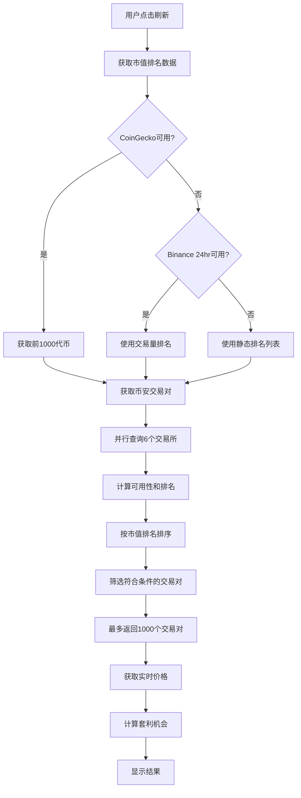

# 市值前1000代币套利监控功能说明

## 功能概述

本次更新为 CEX 跨交易所套利监控系统添加了**市值前1000代币监控**功能，实现了以币安为基准的全面套利机会识别系统。

## 核心改进

### 1. 市值排名集成

系统现在支持三层市值排名机制：

#### 第一层：CoinGecko API（首选）
- 实时获取全球市值排名前1000的加密货币
- 每次刷新交易对时自动更新最新排名
- 按市值从高到低优先显示代币

#### 第二层：Binance 24小时交易量（备用）
- 当 CoinGecko API 不可用时，使用币安24小时交易量数据
- 按交易量排序，作为市值的代理指标
- 确保系统在各种网络条件下都能正常工作

#### 第三层：静态市值列表（兜底）
- 内置300+主流代币的市值排名
- 包含 BTC, ETH, BNB, SOL, XRP, ADA 等主流币种
- 覆盖 DeFi、Layer1/Layer2、NFT、Meme 等各类热门代币
- 确保系统始终能提供有意义的排名数据

### 2. 智能筛选策略

系统采用多维度筛选策略：

```
筛选规则：
├─ 市值前1000代币
│  └─ 至少在2个交易所可交易（包括币安）
│     → 优先级最高，按市值排名显示
│
└─ 其他代币
   └─ 至少在3个交易所可交易
      → 按交易所可用性排序
```

### 3. 数据展示优化

每个交易对现在显示：
- **交易对名称**（如 BTCUSDT）
- **市值排名**（如 "市值排名: #1"，绿色文字）
- **交易所可用性**（如 "5/7 交易所"，灰色文字）

示例：
```
BTCUSDT
市值排名: #1
5/7 交易所
```

## 技术实现

### API 调用流程



### 关键函数

#### getTopTokensByMarketCap()
- 从 CoinGecko 获取市值数据
- 每页250个，最多4页（共1000个）
- 返回 Map<symbol, rank>

#### getStaticMarketCapRanking()
- 提供300+代币的静态排名
- 覆盖主流和热门代币
- 作为最后的兜底方案

#### getBinance24hrTicker()
- 获取币安24小时交易数据
- 按交易量排序
- 作为市值排名的备用指标

#### getCommonTradingPairs()
- 整合所有排名数据源
- 智能筛选和排序
- 返回最多1000个交易对

## 使用说明

### 查看市值排名

1. 进入 "CEX 套利监控" 页面
2. 点击 "刷新交易对" 按钮
3. 等待系统加载（约10-30秒）
4. 查看表格中的市值排名信息

### 筛选套利机会

系统自动按以下优先级排序：
1. **市值越高，越靠前**（#1 > #2 > #3...）
2. **可用交易所越多，越靠前**（7/7 > 6/7 > 5/7...）
3. **价差越大，越值得关注**（>2% 为金色高亮）

### 注意事项

⚠️ **刷新频率限制**
- CoinGecko 免费 API 有调用限制
- 建议不要频繁点击"刷新交易对"
- 使用自动刷新功能时，建议间隔设置为30秒或更长

⚠️ **数据准确性**
- 市值排名数据可能有几小时延迟
- 静态列表会定期更新，但不是实时的
- 价格数据是实时的

⚠️ **套利风险**
- 市值排名高不代表套利一定安全
- 需要考虑流动性、手续费、提币时间等因素
- 建议先小额测试

## 性能优化

### 并行请求
- 所有交易所 API 并行调用
- CoinGecko 多页数据并行获取
- 最大程度减少等待时间

### 超时控制
- 每个 API 请求都有超时限制
- 失败请求不影响其他数据源
- 自动降级到备用方案

### 缓存机制
- 交易对列表缓存在本地状态
- 只有点击"刷新交易对"时才重新获取
- 价格数据实时更新，不缓存

## 示例场景

### 场景1：寻找主流币套利机会

```
用户操作：
1. 打开 CEX 套利监控
2. 查看列表顶部（市值排名靠前的）
3. 找到 BTCUSDT、ETHUSDT 等主流币
4. 观察价差 > 0.5% 的机会

优势：
- 主流币流动性好，容易成交
- 价格稳定，风险相对较小
- 多个交易所支持，选择多
```

### 场景2：发现小币种高价差机会

```
用户操作：
1. 滚动到列表中部或底部
2. 找到市值排名 #200-#1000 的代币
3. 重点关注价差 > 2% 的机会
4. 检查交易所可用性（建议 ≥ 4 个）

注意：
- 小币种价差通常更大
- 但流动性可能不足
- 需要仔细评估风险
```

### 场景3：批量监控套利机会

```
用户操作：
1. 启用自动刷新（间隔30秒）
2. 按价差排序表格
3. 持续观察价差变化
4. 捕捉短暂的高价差机会

技巧：
- 使用大屏幕或多显示器
- 设置合理的刷新间隔
- 准备好多个交易所账户
```

## 故障排除

### 问题1：市值排名显示不全

**可能原因**：
- CoinGecko API 达到调用限制
- 网络连接问题
- API 服务暂时不可用

**解决方案**：
1. 等待几分钟后重试
2. 系统会自动使用备用数据源
3. 主流币种（前300名）始终有排名数据

### 问题2：加载速度慢

**可能原因**：
- 需要查询多个 API
- 网络延迟
- 交易对数量多

**解决方案**：
1. 耐心等待30秒左右
2. 检查网络连接
3. 如果超时，系统会自动降级到默认列表

### 问题3：某些代币没有排名

**可能原因**：
- 代币未进入市值前1000
- CoinGecko 未收录
- 是新币或小市值币

**说明**：
- 这是正常现象
- 不影响价格监控和套利检测
- 这些币种按交易所可用性排序

## 未来优化方向

1. **更多数据源**
   - 集成 CoinMarketCap API
   - 添加更多交易量数据源
   - 支持自定义排名规则

2. **高级筛选**
   - 按市值范围筛选
   - 按价差阈值筛选
   - 按交易所数量筛选

3. **历史数据**
   - 记录历史套利机会
   - 分析套利成功率
   - 生成收益报告

4. **通知功能**
   - 价差超过阈值时推送通知
   - 支持邮件、Telegram、微信等
   - 自定义通知规则

## 总结

本次更新实现了完整的市值前1000代币监控功能，提供了：

✅ 三层市值排名机制（CoinGecko + Binance + 静态列表）
✅ 智能筛选和排序算法
✅ 实时价格监控和套利识别
✅ 最多支持1000个交易对同时监控
✅ 友好的用户界面展示

用户现在可以：
- 轻松找到主流币种的套利机会
- 发现小市值币种的高价差机会
- 实时监控全球市值前1000的代币
- 在7个主流交易所之间寻找套利空间

**开始使用：打开 CEX 套利监控页面，点击"刷新交易对"按钮即可！**
